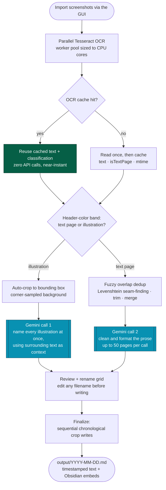
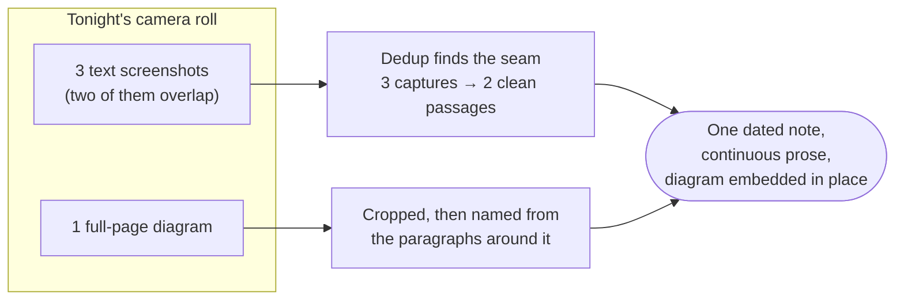
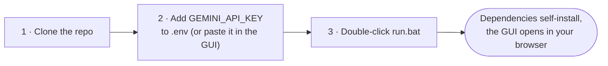

# E-Reader Screenshot Transcriber

> *"The palest ink is better than the best memory."* — Chinese proverb

A local pipeline that turns a pile of e-reader screenshots into a dated, searchable Markdown note. Tesseract reads the pixels on your own machine, fuzzy matching stitches overlapping pages back into continuous prose, full-screen illustrations get cropped and named from their surrounding context, and a single batched Gemini call cleans the day into something you would actually want to re-read. Everything lands in `output/YYYY-MM-DD.md` with Obsidian-style embeds, ready to drop straight into a vault.

📺 **[Watch the usage guide](https://youtu.be/qgqcT_7qKWU)**

## Why this exists

Reading on a phone produces screenshots. A passage lands, you press the buttons, and the moment goes into the camera roll — hundreds of them, stacked like pressed flowers. The words inside stay locked in pixels: you cannot search them, quote them, link them, or fold them into anything you write later. The archive grows while the reading evaporates.

The usual advice splits three ways. Export highlights from your bookstore — which works only when you bought the book there and read it in their app. Retype the passages by hand — which nobody sustains past week two. Or push the images through a generic cloud OCR — which charges per page, ships your reading list to a stranger, and hands back a wall of noise: page numbers, battery icons, clock times, and the same paragraph three times over.

That last complaint deserves attention, because it explains why raw OCR alone never finished the job. **Screenshots overlap.** Scroll a little, capture again, and the top of the new image repeats the tail of the old one. An honest transcription has to find that seam and sew it, not staple the pages together and call it a day.

So this tool does the whole job locally first and reaches for the network last. A worker pool sized to your CPU runs Tesseract across every screenshot and caches each result, so re-runs cost nothing. A pixel check on the reader's header band sorts text pages from illustrations — which means a near-empty chapter opener classifies correctly instead of passing for a picture. Fuzzy Levenshtein matching locates the overlap between consecutive pages and merges them. Illustrations get cropped to their bounding box. Only then does Gemini see anything, and only twice: one batched call names every illustration, one cleans the day's text. A typical reading day spends **one or two API calls** total.

Your books stay yours, your reading list stays on your machine, and the day comes out as a note you can actually use.

Nothing else did this, so this had to exist. Now it does, and you can have it for free.

## How it works

One reading day flows through in a single pass. The two Gemini calls appear in cyan; the cache path in green costs nothing at all:



Two details carry most of the weight. The **classifier** keys on a UI band that appears on every reading page rather than on word count, so sparse pages — chapter starts, pull quotes, tables of contents — never get misfiled as artwork. The **deduplicator** slides an anchor window from the tail of one page against the head of the next and scores it with a pure-JavaScript edit-distance ratio, so a mid-scroll double-capture collapses into one continuous passage.

## A day in the life

You read forty minutes before bed, screenshotting whatever lands. Two of those captures overlap, and one holds a full-page diagram:



The diagram arrives as `2026 05 29 My Book Title Chapter Map.jpg`, embedded exactly where it fell in the reading — not appended to the bottom as an orphan.

## Setup

### Prerequisites

- Node.js (LTS recommended) — from [nodejs.org](https://nodejs.org/)
- A Google Gemini API key — from [Google AI Studio](https://aistudio.google.com/)

### Installation



1. **Clone it:**
   ```bash
   git clone https://github.com/DyllonWright/E-Reader-Screenshot-Transcriber
   cd E-Reader-Screenshot-Transcriber
   ```

2. **Add your key** — create `.env` in the project root:
   ```
   GEMINI_API_KEY=YOUR_KEY_HERE
   ```
   You can skip this and paste the key straight into the GUI on first launch instead; it writes `.env` for you.

3. **Double-click `run.bat`.** It installs dependencies on first run, starts the server, and opens the interface. No build step, no global installs.

## The four steps

**1 — Configure & import.** Set the current book title (it persists to `meta.json` and pre-fills every later session). Load screenshots through the native file picker; they copy into `screenshots/` and start OCR-caching in the background immediately. Pick the date batch to process. Optionally type a hint beside any detected illustration — *"world map"*, *"chapter opener"* — to sharpen how Gemini names it.

**2 — AI processing.** A live terminal streams every OCR read, each dedup decision, and both Gemini calls as they happen.

**3 — Review & rename.** Each cropped illustration appears beside its suggested filename in an editable field. Fix anything you dislike before a single file gets written.

**4 — Complete.** Crops write to `output/YYYY-MM-DD Extracted Images/` spaced 100 ms apart, which keeps Windows creation timestamps in true chronological order. The daily note writes to `output/YYYY-MM-DD.md`. One button opens the folder.

## Output format

```markdown
# Reading – [[2026-05-29]]

**12:34:14**
This is the first passage of cleaned-up text, with paragraphs joined into a single line.

**12:34:28**
![[2026 05 29 My Book Title Chapter Map.jpg]]

**12:35:19**
This passage continues after the illustration entry above.
```

Timestamps come from the screenshot filenames, so the note reads back in the order you actually read it.

## API quota notes

This tool calls `gemini-flash-latest`, which carries a free daily request cap. The pipeline treats that cap as a real constraint:

| Stage | Cost |
|---|---|
| Illustration naming | **1 call**, no matter how many illustrations |
| Text transcription | **1 call** per 50 OCR pages — a typical day needs one |
| Re-running a processed day | **0 calls** — the OCR cache absorbs it |

Google trimmed free-tier limits considerably at the end of 2025, and the exact ceiling varies per project, so treat your [AI Studio rate-limit page](https://aistudio.google.com/rate-limit) as the authority. The **Dev Stats** panel tracks calls, response times, and token counts per 24-hour UTC window against a daily target you set yourself.

Retries use exponential backoff on transient errors (429 rate limit, 503 overload) and count once, not once per attempt.

## CLI mode (legacy)

The original headless script still runs the same core pipeline:

```powershell
node processScreenshots.js
```

Drop screenshots in `screenshots/`, run it, collect Markdown from `output/`. Handy for automation and unattended batches.

## Project layout

```
E-Reader-Screenshot-Transcriber/
│
├── gui/                          ← Local web GUI (Express + vanilla frontend)
│   ├── server.js                 ← API endpoints, OCR orchestration, Gemini calls, SSE streaming
│   └── public/
│       ├── index.html            ← Four-step stepper interface
│       ├── style.css             ← Glassmorphic dark theme over an animated cosmic canvas
│       └── app.js                ← State, uploads, live log listener, review grid
│
├── screenshots/                  ← Drop raw captures here (Screenshot_YYYYMMDD_HHMMSS_*.jpg/png)
├── output/                       ← Daily notes + per-date image folders
│   ├── YYYY-MM-DD.md
│   └── YYYY-MM-DD Extracted Images/
│
├── .ocr_cache/                   ← Per-image OCR + classification cache (auto-managed)
├── .pipeline_cache/              ← Per-date pipeline state, allows resuming (git-ignored)
├── meta.json                     ← Book title, recent books, illustration hints (git-ignored)
├── gemini_stats.json             ← API timing/token log by UTC window (git-ignored)
├── .env                          ← GEMINI_API_KEY (git-ignored)
├── processScreenshots.js         ← Legacy CLI entrypoint
├── run.bat                       ← One-click launcher
└── eng.traineddata               ← Bundled Tesseract English model
```

`.ocr_cache/` and `.pipeline_cache/` rebuild themselves on demand, so deleting them costs only time.

## Built with

| Package | Role |
|---|---|
| `express` | Local server behind the GUI |
| `tesseract.js` | On-device OCR, multi-worker scheduler |
| `jimp` | Pure-JS image loading and bounding-box cropping |
| `@google/generative-ai` | Gemini client (`gemini-flash-latest`) |
| `dotenv` | Reads `GEMINI_API_KEY` from `.env` |

Further architecture notes live in [ARCHITECTURE.md](ARCHITECTURE.md).
